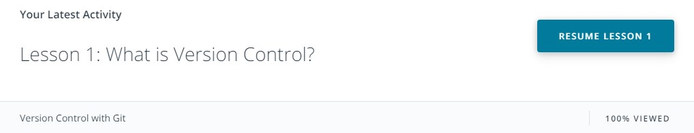
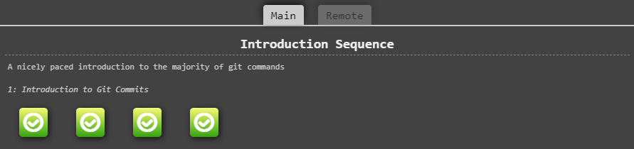
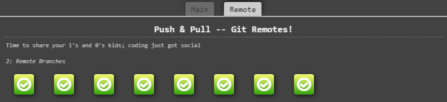
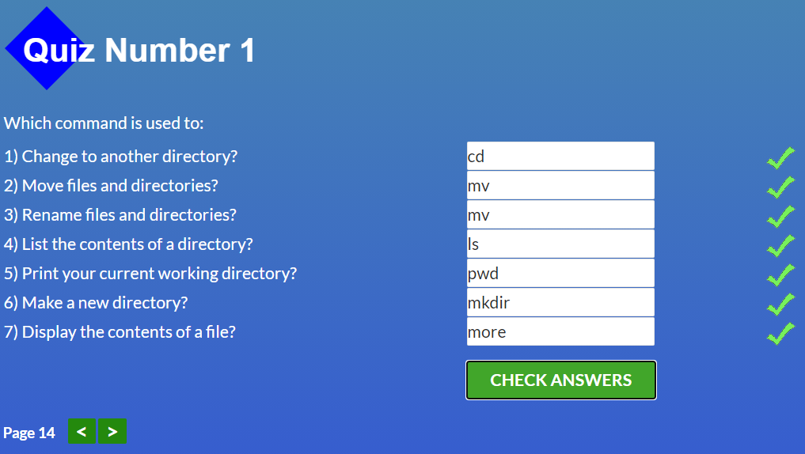
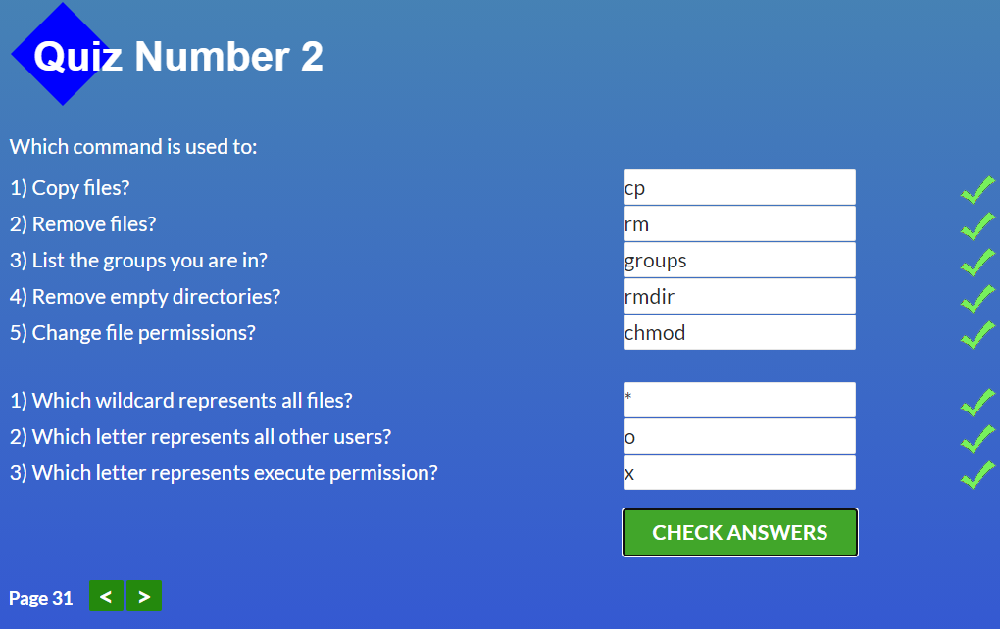
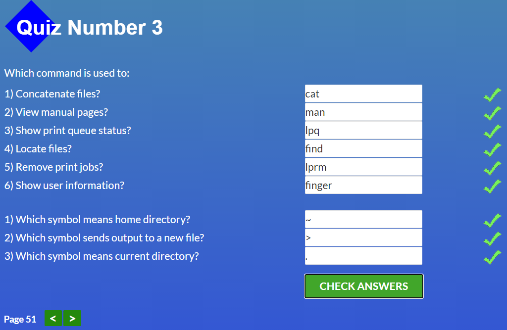
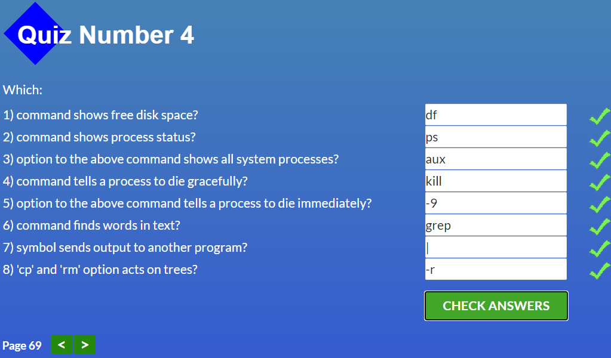

# kottans-frontend
Repository for notes about Kottans Front-End course and progress reports

# General

## [0. Git and GitHub intro](https://github.com/kottans/frontend/blob/master/tasks/git-intro.md)

 
Screenshots

 

 

 
 

 
Reflections

 
 ### What was new:
 The level of my Git knowledge was completely zero before this course.
 Frankly, as a beginner I used to avoide this topic, because I thought it's
 too early for me to learn it. But thanks to Kottans I've finally dived into it.
 And I think the [resources](https://www.udacity.com/course/version-control-with-git--ud123) that were provided
 are the best choise to start with.
 Especially the [learngitbranching](https://learngitbranching.js.org/) game!
 That's an awesome way to learn, thanks for offering it.
   
  ### What surprised me:
  Git basics have been not so hard as I first feared. But "Remote/1.8 Locked Master" level made me
  look hard into reference documentation to pass it in only 3 steps! 
  
  ### What I'm going to use in future:
  Hmm..is there something that i'm NOT going to use?))
  I think I'll use all of these commands. While trying to synchronize local repo with GitHub and making lots of mistakes
  I've already used even those commands that weren't covered in this course:)

---

## [1. Linux CLI and HTTP](https://github.com/kottans/frontend/blob/master/tasks/linux-cli-http.md)

 
Screenshots

 

 

 

 

 
Reflections

 
  ### What was new:
 In [Linux CLI](https://linuxsurvival.com/linux-tutorial-introduction/) part everything was new to me, except of few commands
 I've seen before in Git tutorials on YouTube.
 The same thing with [HTTP](https://code.tutsplus.com/tutorials/http-the-protocol-every-web-developer-must-know-part-1--net-31177) articles.
   
 ### What surprised me:
 Using CLI for managing print jobs surprised me. I'm too used to use GUI for that purpose)
 As for HTTP part, I was surprised that I need to have some networking basics knowledge to attain full understanding of these articles. 
 I thought  they were for complete beginners.
 What does "HTTP doesn't keep state" actually mean? What is TCP/IP port? So I've searched the answers to my questions,
 and now I know what is OSI model, how TCP/IP is used as transport and how the Internet really works (in general) :) And what is HTTP, of course.  
  
 ### What I'm going to use in future:
 I will use CLI commands for manipulating files and directories, no doubt. 
 And I'm going to take courses that are listed in "Optional" and "Extra materials" sections in future.

